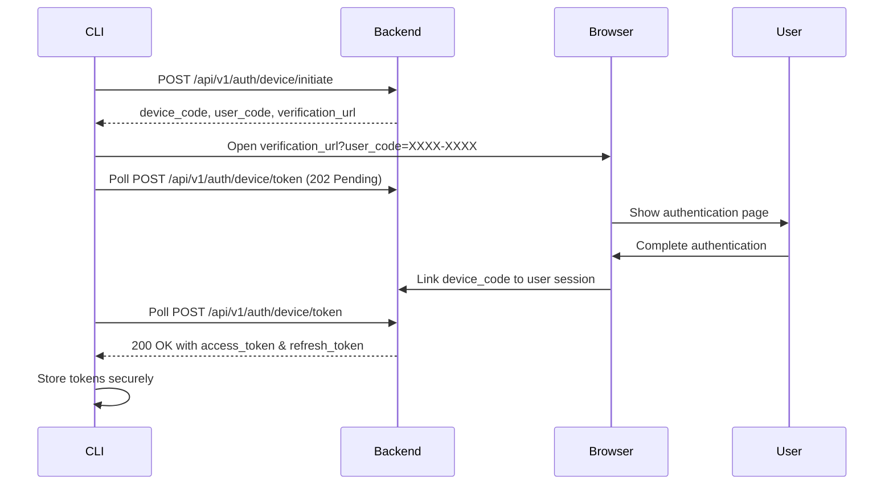

# CyberWave CLI Authentication Architecture

## Overview

This document describes the implementation of web-based device flow authentication for the CyberWave CLI, which provides a secure and user-friendly way to authenticate without entering credentials directly in the terminal.

## ✅ Implementation Status

The CyberWave CLI has been successfully built with the following authentication features:

### ✅ Completed Features

1. **Web-Based Device Flow Authentication**
   - Device flow initiation and polling
   - Automatic browser opening
   - Manual authentication mode
   - Secure token exchange

2. **Authentication Commands**
   - `cyberwave auth login` - Web-based authentication
   - `cyberwave auth logout` - Clear stored credentials
   - `cyberwave auth status` - Show authentication status
   - `cyberwave auth config` - Configuration management

3. **Configuration Management**
   - TOML-based configuration file (`~/.cyberwave/config.toml`)
   - Backend/frontend URL configuration
   - Default workspace/project settings
   - Environment variable support

4. **Secure Token Storage**
   - System keychain integration (macOS/Windows/Linux)
   - Fallback to encrypted JSON file
   - Automatic token refresh
   - Secure token cleanup

5. **CLI Integration**
   - Plugin architecture with auth plugin
   - Automatic plugin discovery
   - Comprehensive help and documentation

## Architecture

### Device Flow Authentication Process



### File Structure

```
cyberwave-cli/
├── src/cyberwave_cli/
│   ├── core.py                    # Main CLI entry point
│   └── plugins/
│       ├── auth/
│       │   ├── __init__.py
│       │   └── app.py            # Authentication plugin
│       ├── devices/app.py        # Device management
│       ├── projects/app.py       # Project management
│       └── loader.py             # Plugin discovery
├── docs/
│   └── device-flow-api.md        # Backend API specification
├── pyproject.toml                # Package configuration
└── README.md                     # User documentation
```

## Authentication Flow Details

### 1. Login Process

```bash
$ cyberwave auth login
```

1. **Initiate Device Flow:** CLI calls `/api/v1/auth/device/initiate`
2. **Display Code:** Shows user code (e.g., `A4B7-C9D2`) and verification URL
3. **Open Browser:** Automatically opens `https://app.cyberwave.com/auth/device?user_code=A4B7-C9D2`
4. **Poll for Completion:** CLI polls `/api/v1/auth/device/token` every 5 seconds
5. **Receive Tokens:** When user completes auth, CLI receives access & refresh tokens
6. **Store Securely:** Tokens stored in system keychain or encrypted file

### 2. Token Storage Hierarchy

1. **Primary:** System keychain (preferred)
   - macOS: Keychain Access
   - Windows: Windows Credential Store  
   - Linux: Secret Service (GNOME Keyring/KWallet)

2. **Fallback:** Encrypted JSON file at `~/.cyberwave/token_cache.json`

### 3. Configuration Management

Configuration is stored in `~/.cyberwave/config.toml`:

```toml
backend_url = "https://api.cyberwave.com"
frontend_url = "https://app.cyberwave.com"
default_workspace = 1
default_project = 42
```

## Backend Implementation Required

### Database Schema

```sql
CREATE TABLE device_auth_sessions (
    id UUID PRIMARY KEY DEFAULT gen_random_uuid(),
    device_code UUID UNIQUE NOT NULL,
    user_code VARCHAR(9) UNIQUE NOT NULL,  -- Format: XXXX-XXXX
    user_id INTEGER REFERENCES users(id) NULL,
    expires_at TIMESTAMP NOT NULL,
    created_at TIMESTAMP DEFAULT CURRENT_TIMESTAMP,
    completed_at TIMESTAMP NULL
);
```

### API Endpoints

1. **POST /api/v1/auth/device/initiate**
   - Generates device_code and user_code
   - Returns verification URL and polling parameters

2. **POST /api/v1/auth/device/token**
   - Accepts device_code
   - Returns 202 (pending) or 200 (success with tokens)

### Frontend Integration

Frontend needs a device authentication page at `/auth/device` that:
- Accepts `user_code` parameter
- Prompts for login if not authenticated
- Shows confirmation page after linking device

## Security Features

### Token Security
- **Secure Storage:** System keychain or encrypted file
- **Short-lived Access Tokens:** Automatic refresh
- **Long-lived Refresh Tokens:** For seamless re-authentication
- **Secure Cleanup:** Proper token deletion on logout

### Device Flow Security
- **Short Expiration:** 5-minute device code expiration
- **Single Use:** Device codes invalidated after use
- **Rate Limiting:** Protection against abuse
- **Secure Random Generation:** Cryptographically secure codes

## Usage Examples

### Basic Authentication
```bash
# Login
cyberwave auth login

# Check status
cyberwave auth status

# Logout
cyberwave auth logout
```

### Configuration
```bash
# Set backend URL
cyberwave auth config backend_url https://api.cyberwave.com

# Set defaults to avoid repeating parameters
cyberwave auth config default_workspace 1
cyberwave auth config default_project 42

# Now commands work without specifying workspace/project
cyberwave projects list
cyberwave devices register --name "My Robot"
```

### Development Setup
```bash
# Configure for local development
cyberwave auth config backend_url http://localhost:8000
cyberwave auth config frontend_url http://localhost:3000
cyberwave auth login
```

## Alternative Authentication Methods

### Environment Variables (CI/CD)
```bash
export CYBERWAVE_USER="user@example.com"
export CYBERWAVE_PASSWORD="password"
export CYBERWAVE_BACKEND_URL="https://api.cyberwave.com"
```

### Manual Token Setting (Advanced)
```python
from cyberwave import Client

client = Client()
client._access_token = "your-access-token"
client._refresh_token = "your-refresh-token"
client._save_token_to_cache()
```

## Testing

### Manual Testing Checklist
- [ ] `cyberwave auth login` opens browser
- [ ] User code entry works on frontend
- [ ] CLI receives tokens after authentication
- [ ] `cyberwave auth status` shows authenticated user
- [ ] Tokens persist across CLI sessions
- [ ] `cyberwave auth logout` clears tokens
- [ ] Configuration commands work
- [ ] Default workspace/project settings work

### Integration Testing
- [ ] Device flow initiation
- [ ] Token polling (pending state)
- [ ] Successful token exchange
- [ ] Expired device code handling
- [ ] Invalid device code handling
- [ ] Rate limiting

## Next Steps

### For Backend Team
1. Implement device auth endpoints (see `docs/device-flow-api.md`)
2. Add database schema for device sessions
3. Implement user code generation
4. Add rate limiting and security measures

### For Frontend Team
1. Create `/auth/device` page
2. Handle user_code parameter
3. Implement device authorization UI
4. Add success/error handling

### For CLI Team
1. Add more comprehensive error handling
2. Implement token refresh edge cases
3. Add unit tests for auth plugin
4. Consider adding plugin for other auth methods

## Benefits

✅ **User Experience**
- No password entry in terminal
- Supports all web auth methods (2FA, SSO)
- Familiar authentication flow

✅ **Security**
- Secure token storage
- Automatic token refresh
- No credentials in environment variables

✅ **Developer Experience**
- Easy local development setup
- Clear configuration management
- Comprehensive help and documentation

✅ **Operational**
- Suitable for CI/CD with env vars
- Plugin architecture for extensibility
- Consistent with modern CLI tools

The CyberWave CLI now provides a modern, secure, and user-friendly authentication experience that follows industry best practices while maintaining flexibility for different deployment scenarios. 